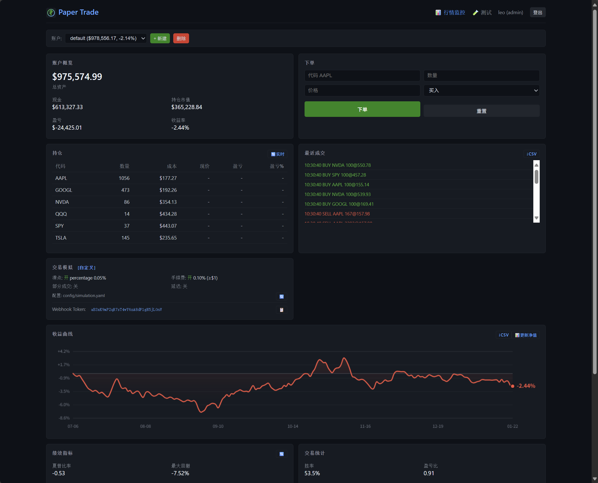

# PPT - Paper Trade 模拟交易平台

轻量级模拟交易平台，支持多账户、实时行情、交易模拟、绩效分析、Webhook 信号接收。

> 未寻得简洁、解耦且架构清晰的现有方案，遂自研之。

🚀 ***ZuiLow** 一站式Ai交易平台子项目，敬请期待！*



---

## 核心功能

| 功能 | 说明 |
|------|------|
| 手动下单 | Web UI 买入/卖出 |
| 多账户 | 创建/切换/删除，支持多策略 |
| Webhook | 接收外部信号，兼容 TradingView |
| 交易模拟 | 滑点/手续费/部分成交 |
| 绩效分析 | 夏普比率/最大回撤/胜率 |
| 用户认证 | admin/viewer 角色权限 |

---

## 快速开始

```bash
# 1. 配置环境
cp env.example .env
# 编辑 .env 设置 SECRET_KEY 和 WEBHOOK_TOKEN

# 2. 启动服务
./run_ppt_server.sh

# 或 Docker 部署
./deploy_ppt_server.sh upd
```

**访问**: http://localhost:11182

**默认用户**: 
admin / admin123
ppt / ppt

---

## 文档

| 文档 | 说明 |
|------|------|
| [功能概览](doc/feature_comparison.md) | 完整功能列表 |
| [API 使用](doc/api.usage.md) | API 端点和示例 |
| [Webhook](doc/webhook.md) | 外部信号接入 |
| [部署说明](doc/docker_setup.md) | Docker 部署详情 |
| [开发计划](doc/plan.md) | 功能状态和计划 |

---

## 技术栈

Flask / SQLite / yfinance / Docker

### Licence

No Licence

